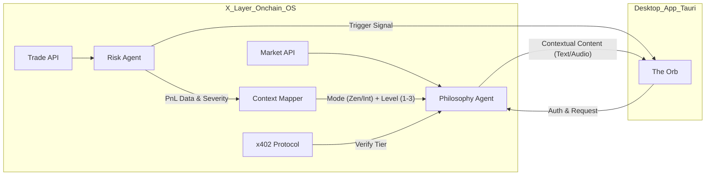

# PRD: Echo Sentinel - The Orb (X Layer Onchain OS Edition)

## 0. Metadata / 系统上下文
* **Product Name:** Echo Sentinel (Orb Edition)
* **Target Platform:** X Layer (L2), Onchain OS
* **Core Protocol:** x402 (Agentic Payments), Trade API, Market API
* **Design Philosophy:** 在波动中寻找不动心 (Finding Immovability in Volatility)
* **Version:** 2.0.0-Hackathon-Sprint
* **Resources:**
    * [Local X Layer RPC Doc](./xlayer-rpc.md)
    * **Installed Onchain OS Skills:**
        * `okx-agentic-wallet`, `okx-onchain-gateway`, `okx-x402-payment`
        * `okx-dex-market`, `okx-dex-signal`, `okx-dex-swap`, `okx-dex-token`
        * `okx-wallet-portfolio`, `okx-security`, `okx-audit-log`, `okx-dex-trenches`

---

## 1. 产品愿景 (Executive Summary)
**Echo Sentinel** 不仅仅是一个风险控制工具，更是一个交易员的“精神守望者”。我们的核心逻辑并非简单的“平复情绪”，而是引导交易员在市场的剧烈波动中寻找**“不动心”**。

**愿景精髓：** “交易不是为了战胜市场，而是为了在市场的起伏中保持自我的完整。”

灵动球通过实时监控与多层级的哲学干预（免费层文字/付费层语音冥想），帮助交易员超越盈亏的表象，重塑与金钱、风险及自我的关系。

---

## 2. 角色定义 (Multi-Agent Specification)

### 2.1 风险哨兵 (The Enforcer / Risk Agent)
* **定位：** 链上合规与风险官。
* **数据输入：** `Onchain OS Trade API` (实时交易流)。
* **判定逻辑：** 
    * `Drawdown_Trigger`: 单笔亏损 > $X\%$ 或 当日回撤 > $Y\%$。
    * `Velocity_Trigger`: 1小时内交互次数 > 历史均值 $3\sigma$。
* **动作：** 发射 `State: TILT` 信号给哲学哨兵；执行 UI 强制遮蔽（物理冷却）。

### 2.2 哲学哨兵 (The Sage / Philosophy Agent)
* **定位：** 认知重构与冥想导师。
* **数据输入：** `Onchain OS Market API` (市场背景), `User_Preference` (哲学流派)。
* **动作：** 
    * 管理 `Agentic Payment` (代理付费) 与订阅状态验证。
    * 通过 Gemini TTS (`gemini-2.5-flash-preview-tts`) 生成多模态冥想语音。

---

## 3. 核心功能需求 (Functional Requirements)

### 3.1 桌面灵动球 (The Orb UI/UX)
* **状态机 (States):**
    * `IDLE`: 青色呼吸灯 (正常)。
    * `MONITORING`: 粒子流加速 (交易中)。
    * `INTERVENTION`: 深红震动 + 屏幕灰化 (干预中)。
* **交互逻辑:**
    * `Hover`: 显示实时“理智分 (Sanity Score)”。
    * `Right-Click`: 开启“禅定复盘”模式。

### 3.2 深度哲学冥想 (Dynamic Meditation & Agentic Payment)
* **双态模式 (Dual-State Modes):**
    * **[INTERVENTION] 亏损干预:** 针对“情绪失控 (Tilt)”的认知重构。
    * **[ZEN MODE] 盈利收敛:** 针对“过度自信 (Overconfidence)”的心理锚定。
* **付费逻辑 (Payment Model):** 
    * **免费层级 (Free):** 仅提供文字版哲学解构。
    * **付费/订阅层级 (Paid/Sub):** 激活多模态 TTS 语音导航与完整的冥想呼吸指导。
    * 支持 **单笔付费 (Pay-per-Zen)** 或 **月度订阅 (Cognitive Shield Subscription)**。
* **订阅验证:** `Philosophy Agent` 在触发前自动验证支付状态并决定交付形式（Text vs Audio）。

### 3.3 哲学底蕴与分级语境 (Philosophical Graded Context)

为了实现“不动心”，`Philosophy Agent` 采用后验分析视角，根据盈亏幅度提供三个层级的认知引导：

#### A. 盈利语境 (Zen Mode: 1-3)
* **Level 1 (繁星时刻 - 嘉许与肯定):** 对精准的狩猎（观察）与果断的执行表示赞美。承认盈利带来的正向反馈，增强心理效能。
    * *金句:* “此刻的盈利是你与市场深度共鸣的奖赏。享受这瞬时的秩序感。”
* **Level 2 (系统性反思):** 弱化因果联系，从“我的英明”转向“系统的胜利”。
    * *金句:* “优秀的交易者关注过程，平庸的交易者关注结果。” (塔勒布逻辑)
* **Level 3 (去中心化自我的提醒):** 彻底从盈亏中剥离自我。
    * *金句:* “你所拥有的，只是大海暂时借给你的波浪。” (禅宗)

#### B. 亏损语境 (Intervention Mode: 1-3)
* **Level 1 (共情安慰):** 承认心理的刺痛，降低防御机制。
    * *金句:* “感到痛苦是人之常情，但停留在痛苦中是选择。”
* **Level 2 (斯多葛重构):** 区分可控（执行）与不可控（市场）。
    * *金句:* “唯有灵魂的安宁不可被市场剥夺。” (塞内卡)
* **Level 3 (存在主义重构与反脆弱):** 将亏损视为进化的燃料。
    * *金句:* “杀不死我的，使我更强大。” (尼采) / “风会熄灭蜡烛，却能助长山火。你要成为火。” (塔勒布《反脆弱》)

#### C. 核心金句库 (The Golden Quotes)
* **塞内卡:** “我们受难于想象，更甚于现实。”
* **马可·奥勒留:** “阻碍行动的事物，反而促进了行动；阻碍道路的事物，反而成为了道路。”
* **塔勒布:** “反脆弱性超越了韧性。韧性只是抵抗冲击，而反脆弱性则从冲击中获益。”
* **纳瓦尔:** “如果一个决定在短期内痛苦，在长期内可能是有益的。”

---

## 4. 技术链路 (Technical Flow for AI Implementation)



---

## 5. 核心逻辑伪代码 (For Coding Agent)

### 5.1 场景与层级识别 (Context & Level Mapping)
```python
def get_meditation_context(pnl_summary):
    # 根据盈利或亏损幅度映射 L1-L3
    if pnl_summary.current_pnl > 0:
        mode = "ZEN"
        level = 1 if pnl_summary.pnl_pct < 5 else (2 if pnl_summary.pnl_pct < 15 else 3)
    else:
        mode = "INTERVENTION"
        level = 1 if abs(pnl_summary.pnl_pct) < 3 else (2 if abs(pnl_summary.pnl_pct) < 10 else 3)
    return mode, level
```

### 5.2 x402 交付决策
```python
def deliver_content(user, mode, level):
    is_paid = x402.check_subscription(user)
    content = PhiloAgent.generate(mode, level)
    
    if is_paid:
        return content.audio_stream, content.full_meditation_guide
    else:
        return content.text_summary, "Upgrade to unlock Audio & Guided Meditation"
```

---

## 6. 开发者备注 (Dev Notes)
* **音频选型:** Google Gemini `gemini-2.5-flash-preview-tts` — 支持通过自然语言 Prompt 控制语气与节奏，更适合冥想导师风格；且无需额外 API Key。
* **安全:** API Key 需通过 Onchain OS 的加密模块存储。
* **性能:** 桌面球应使用 WebGL 渲染粒子，确保低 CPU 占用。
